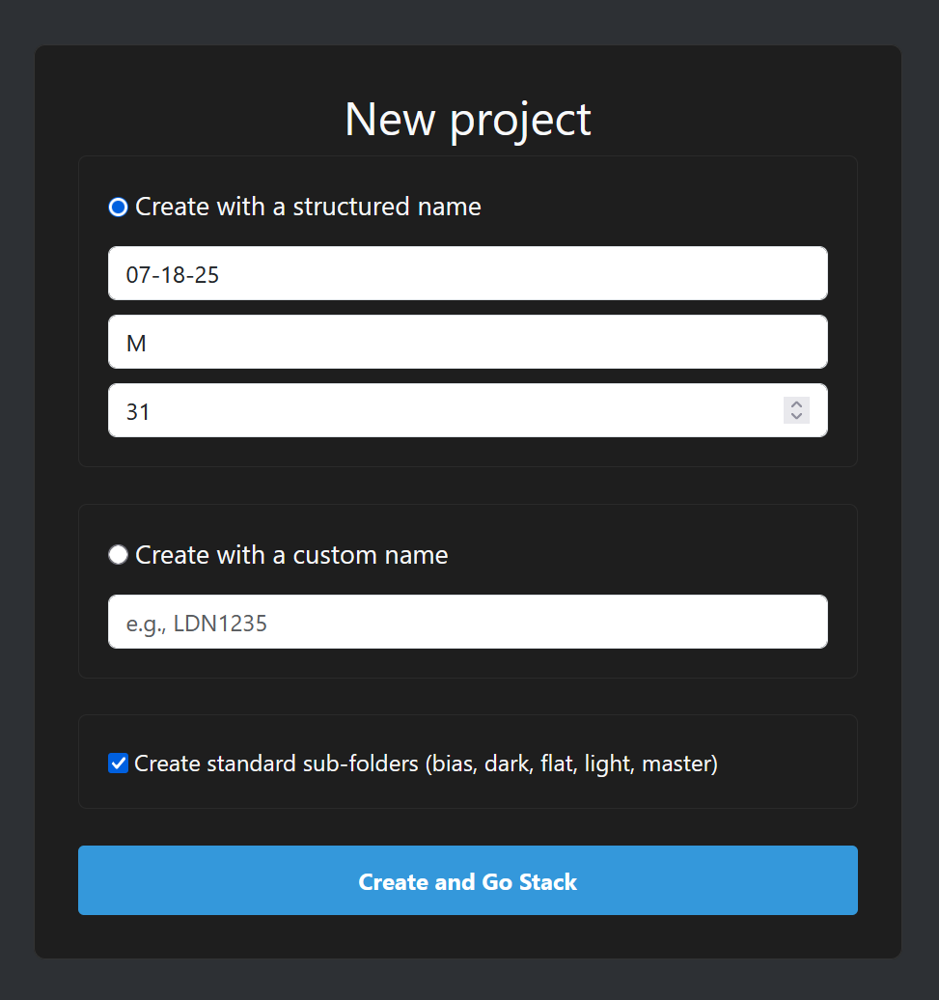
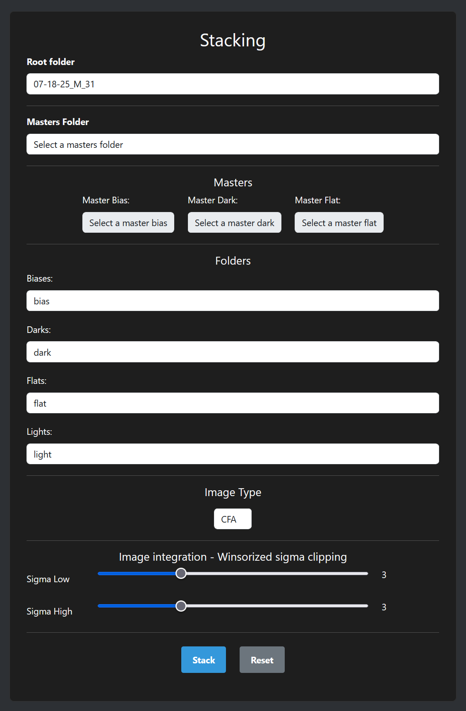
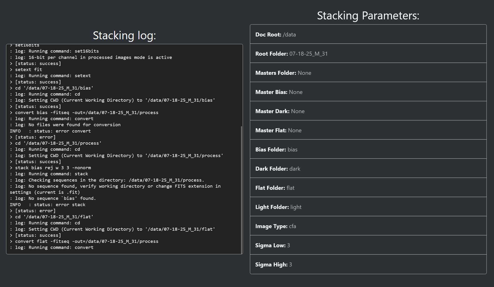
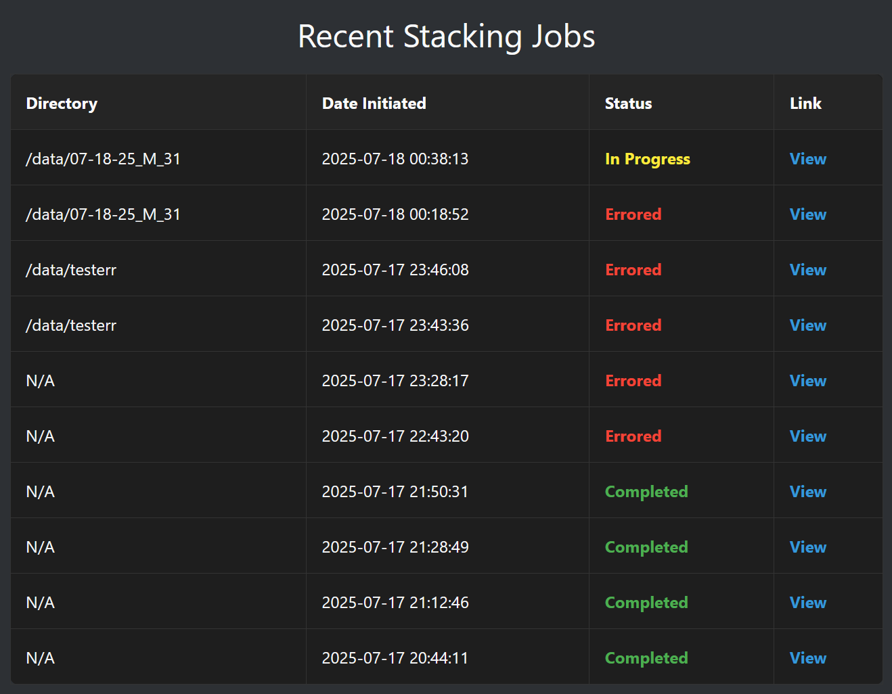
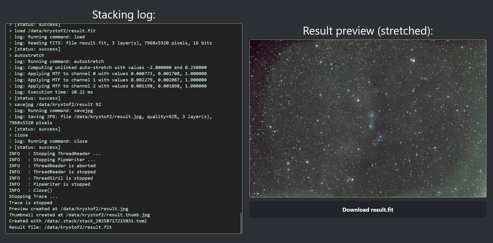

# AstrophotoWebStack
A web interface for astrophoto stacking using Siril.

## Installation

<details><summary>Outdated installation method</summary>

## Installation (APWebUI)
```bash
pip install pipenv
pipenv install
pipenv --venv
> /home/user/.local/share/virtualenvs/AstrophotoWebStack-xxxxxx
```

now update `scripts/app.wsgi` with the path to the virtualenv.

## Apache configuration
```xml
<VirtualHost *:80>
	ServerName 192.168.0.1

	WSGIDaemonProcess flaskapp user=stacker group=stacker threads=5
	WSGIScriptAlias / /var/www/AstrophotoWebStack/scripts/app.wsgi

	<Directory /var/www/AstrophotoWebStack>
			WSGIProcessGroup flaskapp
			WSGIApplicationGroup %{GLOBAL}
			Order deny,allow
			Allow from all
	</Directory>

	ErrorLog ${APACHE_LOG_DIR}/apstack_error.log
	CustomLog ${APACHE_LOG_DIR}/apstack_access.log combined
</VirtualHost>
```

use the correct IP address and path to the app.wsgi file.

## Installation (stacker)

Install pysiril from [wheel](https://gitlab.com/free-astro/pysiril/-/releases):
```bash
pip install pysiril-0.0.15-py3-none-any.whl
```

Install siril executable:
```bash
sudo add-apt-repository ppa:lock042/siril
sudo apt-get update
sudo apt-get install siril
```

(newer version, on normal apt there is an older version)

Now you can run the stacker.py script or automate it with cron (run it automatically every x minutes when it is not already running).

</details>

## Installation

The application can be run through Docker compose, which is the recommended way to run it, as it simplifies the deployment.

The Docker container being built is based on `Arch Linux`, which is the only one I found to reliably compile the latest `siril-cli` from source via `AUR`, from the package `siril-cli-git`. The container also compiles the latest python package `pysiril` from source, which is used to interface with the `siril-cli`.

The docker compose file is simply:
```yml
services:
  web:
    build: .
    ports:
      - "${SERVER_PORT}:8000"
    volumes:
      - ${HOST_DATA_PATH}:/data
    environment:
      - HOME_DIR=/data
      - SIRIL_CLI=/usr/sbin/siril-cli
      - SECRET_KEY=${SECRET_KEY}

  stacker:
    build: .
    volumes:
      - ${HOST_DATA_PATH}:/data
    environment:
      - HOME_DIR=/data
      - SIRIL_CLI=/usr/sbin/siril-cli
      - SECRET_KEY=${SECRET_KEY}
    command: >
      sh -c "while true; do
        echo 'Running stacker script...';
        python stacker.py;
        echo 'Stacker run complete. Sleeping for ${STACKER_INTERVAL_S} seconds...';
        sleep ${STACKER_INTERVAL_S};
      done"
```

Which needs a `.env` file with the following variables:
```bash
HOST_DATA_PATH=/path/to/data/dir

SERVER_PORT=8000

STACKER_INTERVAL_S=60

SECRET_KEY=your_super_secret_key_here_change_me
```

To build the docker compose file, simply run:
```bash
docker compose build
```

And then run it:
```bash
docker compose up -d
```

# Acknowledgments
This project uses the following libraries and tools:
- [Siril](https://free-astro.org/index.php/Siril) - for image
- [Flask](https://flask.palletsprojects.com/) - for the web framework


This project is licensed under the Beerware License as seen below (or see the LICENSE file):
```
/*
 * ----------------------------------------------------------------------------
 * "THE BEER-WARE LICENSE" (Revision 42):
 * <admin@swpelc.eu> wrote this file.  As long as you retain this notice you
 * can do whatever you want with this stuff. If we meet some day, and you think
 * this stuff is worth it, you can buy me a beer in return.          Jakub Pelc
 * ----------------------------------------------------------------------------
 */
```


# How to stack data in AstrophotoWebUI

## Create a new project

Go to the new project page and select how you want to create a new project.


You can select a preformated directory name, or name it yourself. The app can also create the necessary subfolders for you, unless you wish to not do so.

This will create a new project folder in your `data` directory, to which you will need to copy your data. Click on the "Create and Go Stack" button to select
the project folders.

## Folder selection

After you visit the stacking page you can select which data is in what folders.



You can also select already created master files, which are placed to another specific folder. This will speedup the stacking process (which in itself is pretty fast in Siril).

You can also select if your data is color (CFA) or monochrome (MONO). A Winsorized sigma clipping parameters can also be changed from their default values.

This section will be expanded upon in the future, now it only supports basic stacking.

## Stacking

After you click on the Stack button, you will be automatically redirected to the stacking progress page (with the current stacking id).



Here you will see the current stacking progress (by the periodically updated log), with the set stacking parameters.

## Browse



If you loose the stacking id, you can always access the latest stacking processes in the browse section, which shows the current state of the processes, and provides links to them.

## Results



After the stacking is completed, you will be automatically redirected to the results page, which shows the stacked image preview (auto stretched for visibility),
and with a download link to the stacked `.fit` image. This image is also located in the `data` directory, in the project folder, called `master.fit`.

