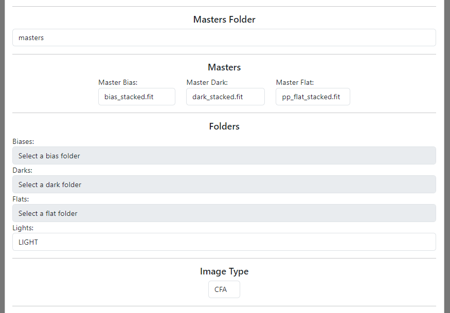

# How to stack data in APWebUI

## Folder selection

Go to the [stacking page](../stack) and select the folder with your data.

Your data needs to be in subfolders in the folders you selected (specific folders for light, biases, darks and flats). You can name those folders any way you want, you will select them in the next step.

Select the image type (color or mono), default is CFA (color filter array), if you wish to change it, do so in the Image Type dropdown.

Change or keep the default values for Sigma clipping, and click on Stack button.

## Masters

If you wish to use masters, select the folder with masters (needs to be in the project folder).

After you select the master folder, you can select individual masters for each type of correction image. The related folder will be greyed out.

Masters need to be 16-bit FP files, .xisf are not currently supported (i will hopefully add support later).

## Stacking

After you click on the Stack button, you will be automatically redirected to the stacking page.

You will hopefully see a moving log, in which you can observe the stacking process.

If the stacking is successful, the log will turn green and you will be redirected to the results page from where you can download the stacked image.

